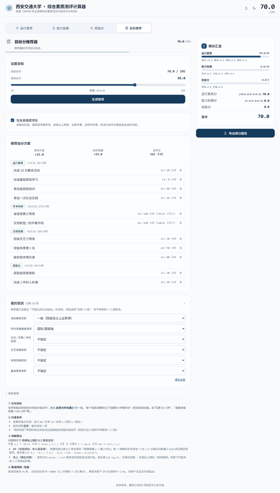

# XJTU 综合素质测评计算器

> 基于 React + Vite 的西安交通大学本科生综合素质测评计算工具，内置**目标分推荐器**（0/1 背包 DP）。

[](https://react.dev/)
[](https://vitejs.dev/)
[](https://tailwindcss.com/)
[](https://xjtu-deyu-calculator.netlify.app)

🔗 **在线 Demo**：<https://xjtu-deyu-calculator.netlify.app>
📖 **算法说明**：[docs/ALGORITHM.md](docs/ALGORITHM.md)

## 目录

- [功能特点](#功能特点)
- [截图](#截图)
- [快速开始](#快速开始)
- [评分规则概览](#评分规则概览)
- [目标分推荐器](#目标分推荐器)
- [部署](#部署)
- [项目结构](#项目结构)
- [技术栈](#技术栈)
- [免责声明](#免责声明)
- [致谢](#致谢)

## 功能特点

### 评分计算
- **三大评分模块**：品行素质（80）+ 能力拓展（20）+ 奖励分（5）= 满分 105
- **实时计算**：所有输入即时反映到总分，自动处理上限封顶与组织任职互斥
- **覆盖 docx 全档位**：竞赛优秀奖、特等奖、体育 4-8 名、破省级纪录、出版专著、发明专利、5 档荣誉表彰等

### 目标分推荐器（算法实验内容）
- **背包 DP 求解**：给定当前得分与目标分，反向求出**总时长最少**的加分组合
- **难度分级**：每项候选标注 normal / hard / very-hard，可一键过滤高难度
- **× 排除**：推荐结果中不想要的项目一键剔除，自动重新推荐，持久化到 localStorage
- **我的现状问卷**：6 维度声明（任职 / 学科竞赛 / 论文 / 文艺 / 体育 / 荣誉）后只推荐"不超过当前档位"的项目

### 体验与导出
- **数据持久化**：自动保存到 localStorage，刷新不丢
- **评分规则提示**：每项旁的 `?` 图标，hover / click 查看详细标准
- **得分可视化**：三模块条形图直观展示提升空间
- **导出 PNG / PDF**：精美评分报告，含 Logo、时间戳、印章水印
- **深色模式 + 响应式**：自动跟随系统偏好，手机/桌面端均适配

## 截图



> 上图：在「目标推荐」tab 中填写「我的现状」并设置目标 95 分后，推荐器给出的总时长最少的加分组合方案。

## 快速开始

```bash
# 克隆仓库
git clone https://github.com/hechuxielianli/xjtu-deyu-calculator.git
cd xjtu-deyu-calculator

# 安装依赖
npm install

# 启动开发服务器
npm run dev

# 构建生产版本
npm run build

# 运行单元测试（64 项断言覆盖推荐器算法与现状过滤）
npm test   # 等价于 node src/algorithms/recommender.test.js
```

## 评分规则概览

### 品行素质分（满分 80 分）

| 项目 | 上限 | 说明 |
|------|------|------|
| 基准分 | 70 | 经班级评议合格、书院审定通过 |
| 集体活动 | 3 | 按次数或突出贡献计算 |
| 思政学习 | 3 | 党团理论学习、省部级培训等 |
| 社会服务 | 4 | 志愿服务、社会实践、挂职锻炼等 |
| 扣分项 | 不限 | 通报批评、处分、旷课等 |

### 能力拓展分（满分 20 分）

| 项目 | 上限 | 说明 |
|------|------|------|
| 学术科研 | 10 | 学科竞赛获奖 + 论文 / 专利 / 专著 |
| 文体竞赛 | 6 | 文艺竞赛 + 体育竞赛 + 破纪录加分 |
| 组织任职 | 4 | 四个职务级别 × 优 / 良 / 合格三档（互斥取最高） |

### 奖励分（满分 5 分）

精神文明荣誉表彰 + 见义勇为类表彰 + 好人好事，累加上限 5 分。

## 目标分推荐器

### 使用方式
1. 在「品行 / 能力 / 奖励」三个 tab 填入现有得分项
2. 切换到「目标推荐」tab
3. 拖动滑块设定目标分 → 点击「生成推荐」
4. （可选）展开「我的现状」声明你已达到的最高档位，让推荐更贴合实际
5. （可选）点击推荐项右侧 × 排除不想要的项目，自动重算

### 算法
- **核心**：分模块 0/1 背包 + 跨模块合并背包（精确最优解）
- **对照**：贪心算法（按性价比降序选取），用于实验对比
- **复杂度**：O(Σ N_i · W_i + Σ W_i · W_j)，实测 < 1 ms
- **候选库**：75 项，覆盖 docx 全档位

详细推导与实测见 [docs/ALGORITHM.md](docs/ALGORITHM.md)。

## 部署

本项目使用 [Netlify](https://www.netlify.com) 部署（国内访问友好）：

1. 将代码推送到 GitHub
2. 访问 <https://app.netlify.com> 并登录（可用 GitHub 账号）
3. 点击 "Add new site" → "Import an existing project"
4. 选择 GitHub，授权并选择仓库 `xjtu-deyu-calculator`
5. Netlify 会自动识别 Vite 配置，直接点击 "Deploy"
6. 此后每次 `git push` 自动触发重新构建

**在线访问**：<https://xjtu-deyu-calculator.netlify.app>

## 项目结构

```
src/
├── App.jsx                        # 主组件（状态管理 + 布局组合，~160 行）
├── index.css                      # Tailwind CSS 入口 + 自定义样式
├── main.jsx                       # React 应用入口
├── algorithms/                    # 算法层
│   ├── recommender.js             # 目标分推荐器（背包 DP + 贪心 + 现状过滤）
│   └── recommender.test.js        # 64 项断言的自动化单测
├── data/
│   ├── constants.js               # 评分数据表 + localStorage 常量
│   └── tooltips.jsx               # 评分规则提示文案（与组件解耦）
├── utils/
│   ├── cn.js                      # className 合并工具
│   ├── listUtils.js               # 列表重排（moveUp / moveDown）
│   └── uid.js                     # 列表项稳定 id 生成
├── components/
│   ├── icons.jsx                  # SVG 图标组件
│   ├── ui.jsx                     # 通用 UI 组件（Card, Badge, Select 等）
│   ├── RuleTooltip.jsx            # 评分规则提示组件
│   ├── ScoreChart.jsx             # 得分分布条形图
│   ├── CollapsibleList.jsx        # 可折叠列表
│   ├── ExportModal.jsx            # 导出弹窗 + Canvas 绘制
│   ├── ScoreSummary.jsx           # 得分汇总卡片
│   ├── BackgroundDecoration.jsx   # 背景装饰层
│   └── tabs/
│       ├── ConductTab.jsx         # 品行素质
│       ├── AbilityTab.jsx         # 能力拓展
│       ├── RewardTab.jsx          # 奖励分
│       └── RecommenderTab.jsx     # 目标分推荐器 UI
└── hooks/
    ├── useScoreCalculator.js      # 评分计算逻辑
    └── useLocalStorage.js         # 本地数据持久化 + 推荐器现状/排除项持久化
```

## 技术栈

| 层面 | 技术 | 版本 / 备注 |
|------|------|------------|
| UI 框架 | React | 19 |
| 构建工具 | Vite | 8 |
| 样式系统 | Tailwind CSS | 4 |
| 算法 | 0/1 背包 DP | 目标分推荐器（精确最优 + 贪心对照） |
| 导出方案 | Canvas API | 高 DPI 评分报告图，无需后端 |
| 部署平台 | Netlify | 自动 CI/CD + CDN + HTTPS |

## 免责声明

本工具仅供参考，最终评分以学校 / 书院官方认定为准。评分规则依据公开文件整理，如有更新请以学校最新通知为准。

## 致谢

- 本项目由 [Claude](https://claude.ai)（Anthropic）辅助开发
- 评分标准依据《西安交通大学本科生专业选择综合素质测评内容及评分标准》
- 算法实验配合《算法设计与分析》课程进行
